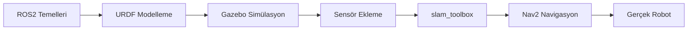

# GARPamr_edu - ROS2 ile AMR Geliştirme Eğitim Materyali

| Dosya | Açıklama |
|-------|----------|
| [Teori.md](./Teori.md) | ROS2, URDF, Gazebo, SLAM, Nav2 teorik anlatımlar |
| [Uygulama.md](./Uygulama.md) | 12 adımlık pratik uygulamalar (tamamlanmış çözümlerle) |
| [Tavsiye Edilen Süreç.md](./Tavsiye%20Edilen%20Süreç.md) | Öğrenme yolu önerileri |


## Gereksinimler

- **Ubuntu 24.04**
- **ROS2 Jazzy** 
- **Gazebo** (gz-harmonic)
- **Python 3.10+**


---

## Öğrenme Yolu



### Önerilen Sıra:
1. **Teori Bölüm 1-3:** Konumlama, URDF, TF kavramları
2. **Uygulama 0-5:** Robot modeli, Gazebo, sensörler
3. **Teori Bölüm 4-5:** Gazebo detayları, slam_toolbox
4. **Uygulama 6-9:** Odometri, haritalama
5. **Teori Bölüm 6-7:** Nav2, gerçek robot
6. **Uygulama 10-11:** Navigasyon uygulamaları

---

## Bu Versiyondaki İyileştirmeler

### Tamamlanan Eksikler
- Uygulama 6 (Odometri) - Tam çözüm
- Uygulama 9 (slam_toolbox) - Launch dosyaları ve parametreler
- Uygulama 10 (nav2 Haritalama) - Tam çözüm
- Uygulama 11 (nav2 Basit Uygulama) - Waypoint scripti

### Eklenen İçerikler
- Mermaid diyagramlar (TF tree, sistem mimarisi)
- micro-ROS örnekleri
- Odometri Python implementasyonu
- Örnek parametre dosyaları (`resources/configs/`)

---

## Proje Yapısı

```
GARPamr_edu/
├── README.md                      # Bu dosya
├── Teori.md                       # Teorik anlatımlar
├── Uygulama.md                    # Pratik uygulamalar
├── Tavsiye Edilen Süreç.md        # Öğrenme yolu
└── resources/
    ├── configs/                   # Örnek YAML dosyaları
    │   ├── slam_toolbox_mapping.yaml
    │   ├── slam_toolbox_localization.yaml
    │   └── nav2_params.yaml
    └── diagrams/                  # Diyagramlar
```


Bu materyal [GARPamr_edu](https://github.com/ngen01/kayra_ros) projesinden esinlenerek geliştirilmiştir.
