# GARPamr_edu - ROS2 ile AMR Geliştirme Eğitim Materyali

> **🚀 Geliştirilmiş Versiyon** - Bu eğitim materyali, GARP AMR robotları için ROS2 eğitim materyalidir.

---

## 📚 İçerik

| Dosya | Açıklama |
|-------|----------|
| [Teori.md](./Teori.md) | ROS2, URDF, Gazebo, SLAM, Nav2 teorik anlatımlar |
| [Uygulama.md](./Uygulama.md) | 12 adımlık pratik uygulamalar (tamamlanmış çözümlerle) |
| [Tavsiye Edilen Süreç.md](./Tavsiye%20Edilen%20Süreç.md) | Öğrenme yolu önerileri |

---

## 🛠️ Gereksinimler

- **Ubuntu 24.04** (veya 22.04)
- **ROS2 Jazzy** (veya Humble)
- **Gazebo Sim** (gz-sim)
- **Python 3.10+**

### Kurulum

```bash
# ROS2 Jazzy kurulumu (Ubuntu 24.04)
sudo apt update && sudo apt install ros-jazzy-desktop

# Gazebo Sim kurulumu
sudo apt install gz-sim

# ROS-Gazebo entegrasyon paketleri
sudo apt install ros-jazzy-ros-gz

# SLAM ve Nav2
sudo apt install ros-jazzy-slam-toolbox ros-jazzy-nav2-bringup
```

---

## 📖 Öğrenme Yolu

```mermaid
graph LR
    A[ROS2 Temelleri] --> B[URDF Modelleme]
    B --> C[Gazebo Simülasyon]
    C --> D[Sensör Ekleme]
    D --> E[slam_toolbox]
    E --> F[Nav2 Navigasyon]
    F --> G[Gerçek Robot]
```



### Önerilen Sıra:
1. **Teori Bölüm 1-3:** Konumlama, URDF, TF kavramları
2. **Uygulama 0-5:** Robot modeli, Gazebo, sensörler
3. **Teori Bölüm 4-5:** Gazebo detayları, slam_toolbox
4. **Uygulama 6-9:** Odometri, haritalama
5. **Teori Bölüm 6-7:** Nav2, gerçek robot
6. **Uygulama 10-11:** Navigasyon uygulamaları

---

## 🆕 Bu Versiyondaki İyileştirmeler

### ✅ Tamamlanan Eksikler
- Uygulama 6 (Odometri) - Tam çözüm
- Uygulama 9 (slam_toolbox) - Launch dosyaları ve parametreler
- Uygulama 10 (nav2 Haritalama) - Tam çözüm
- Uygulama 11 (nav2 Basit Uygulama) - Waypoint scripti

### 📊 Eklenen İçerikler
- Mermaid diyagramlar (TF tree, sistem mimarisi)
- micro-ROS örnekleri
- Odometri Python implementasyonu
- Örnek parametre dosyaları (`resources/configs/`)

---

## 📁 Proje Yapısı

```
GARPamr_edu/
├── README.md                      # Bu dosya
├── Teori.md                       # Teorik anlatımlar
├── Uygulama.md                    # Pratik uygulamalar
├── Tavsiye Edilen Süreç.md        # Öğrenme yolu
└── resources/
    ├── configs/                   # Örnek YAML dosyaları
    │   ├── slam_toolbox_mapping.yaml
    │   ├── slam_toolbox_localization.yaml
    │   └── nav2_params.yaml
    └── diagrams/                  # Diyagramlar
```

---

## 📝 Katkıda Bulunma

Bu eğitim materyali açık kaynak olarak sunulmaktadır. Katkıda bulunmak için:

1. Bu repoyu fork edin
2. Yeni bir branch oluşturun (`git checkout -b feature/yeni-ozellik`)
3. Değişikliklerinizi commit edin
4. Pull request açın

---

## 📜 Lisans

Bu eğitim materyali özgür kullanım için sunulmuştur. Kaynak göstererek paylaşabilirsiniz.

---

## 🙏 Teşekkürler

Bu materyal [GARPamr_edu](https://github.com/ngen01/kayra_ros) projesinden esinlenerek geliştirilmiştir.
